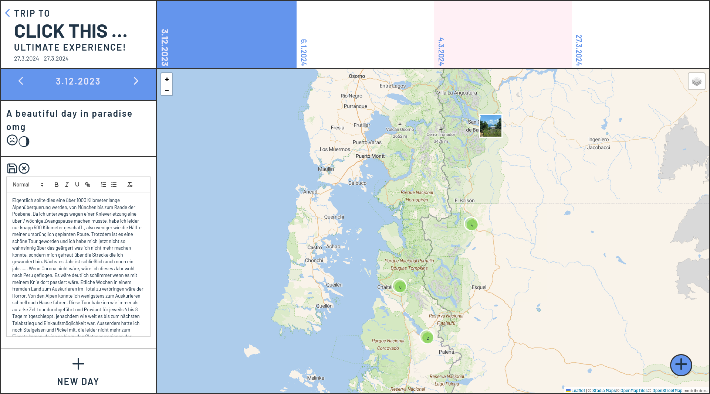

# zeitsprung
Visual storytelling and blogging in time and space.

## getting started:

### Prerequisites:
You will need a PostgreSQL server running and specify its port in the `server/index.js` file.
Install all dependencies. Server and client are two separate projects that need their respective packages to be installed via npm 

*server*:
````
_from the root directory:_

cd server
npm i
```

*client*:
````
_from the root directory:_

cd client server
npm i
```

### run commands:

To run the *server*:
````
_from the root directory:_

cd server
node run index.js
```

To run the *client*:
````
_from the root directory:_

cd client server
npm run dev
```

## Trip selector page:


## Trip view:

## drag and drop images

## detailed EXIF Data

## Inline Editing / Blogging

## Add Days Dialog

## Add Trip Dialog
